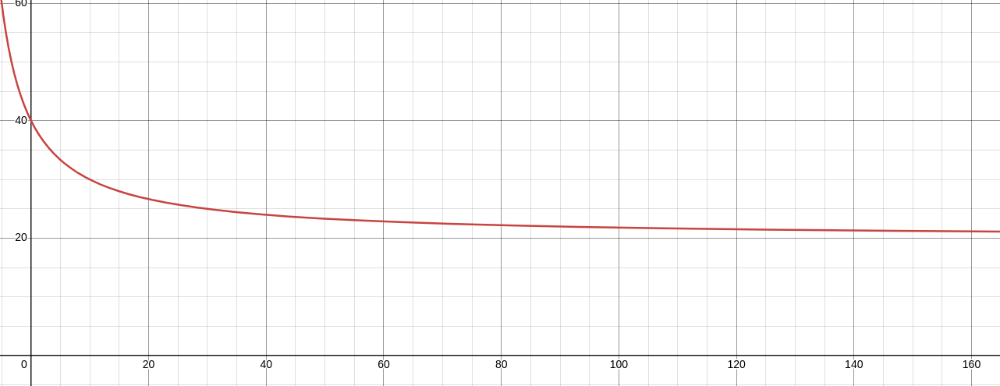
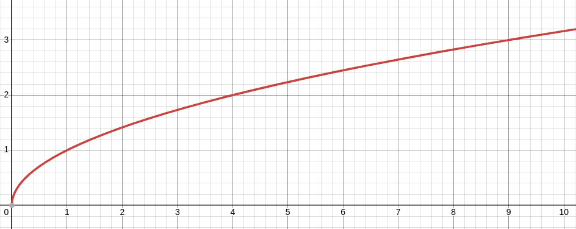

# Rankify

Pool rankings at Waapi (for now ...)

## Development

### Requirements

- Node.js >=18.x
- MongoDB >=7.x

### Running the development server

First, update the `.env.local` file with your MongoDB URI.

To run the development server:

```bash
npm run dev
```

Before creating a pull request, make sure to run the tests:

```bash
npm run test
```

And to test your changes with the production server:

```bash
npm run build && npm run start
```

### Deployment

Pushing to the `main` branch will trigger a deployment to Vercel.

## Elo rating system

In order to keep a fair ranking, I implemented an Elo rating system.
I built something new inspired by [this article](https://towardsdatascience.com/developing-an-elo-based-data-driven-ranking-system-for-2v2-multiplayer-games-7689f7d42a53), which I adapted to an unlimited number of players in each team. All of the elo implementation is in the `elo` module. Unit tests are also there to ensure the correctness of the implementation.

The `elo` module is following these rules:

- Players start with a rating of 1000 (DEFAULT_RATING)

- A difference of 400 (THRESHOLD) points between two players means that the weakest player as 1 out of 10 (POWER) chances to win the game.

- The newer the player, the higher the K-Factor. The K-Factor starts at 40 and tends to 20 as the player plays more games:

  - With x the number of games played:
    - $ K = 20 \cdot(1 + \frac{1}{1+\frac{x}{10}}) $

  

- A big difference in game scores will increase the PFactor.

  - With s1 and s2 the scores of the two players:
    - $ P = \sqrt{|s1 - s2|} $

  

- The expectation of a player is calculated based on the ratings of the players in the team.

  - With $r_1$ and $r_2$ the ratings of the two players:
    - $ E_{t2} = \frac{r1 + r2}{2} $

  - With $r_i$ the ratings of the players and `n` the number of players in the team:
    - $ E_{tn} = \frac{r_1 ... r_i}{n} $

- The new rating of a player is calculated as follow

  - With $R_{old}$ the formed rating of the player, $R_{new}$ the new rating, P the P-Factor and K the K-Factor, $E_p$ the expectation of the player:
    - $ R_{new} = R_{old} \cdot K \cdot P \cdot (1 - E_{p}) $

- TO CONTINUE
- $E_1 = \frac{1}{1 + 10^{\frac{R_2 - R_1}{400}}}$